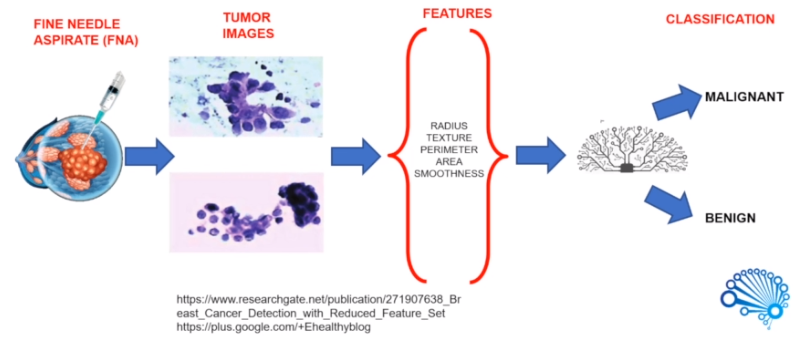

# Breast Cancer Classification

 Breast cancer is the most common cancer among women worldwide, accounting 25% for all cancer cases and affected 2.1 million people in 2015. The key challange in cancer detection is how to classify the cancer into malignant or benign. Research indicated that even experienced Physicians can diagnose cancer with 79% accuracy where as Machine Learning techniques such as Support Vector Machines can diagnose cancer with 91% (upto 97%) accuracy.

 In this project I tried to classify cancer into malignant or benign using features extracted from several images of cancer samples.

 The first step on cancer diagnosis is to do Fine Needle Aspirate, which is simply extracting some of the cells of the tumour. Then some features (around 30) are extracted out from the images of the cell. These are the features that I fed into my ML model to predict the class of the cancer.

 The model was able to predict the class with almost **96%** accuracy.