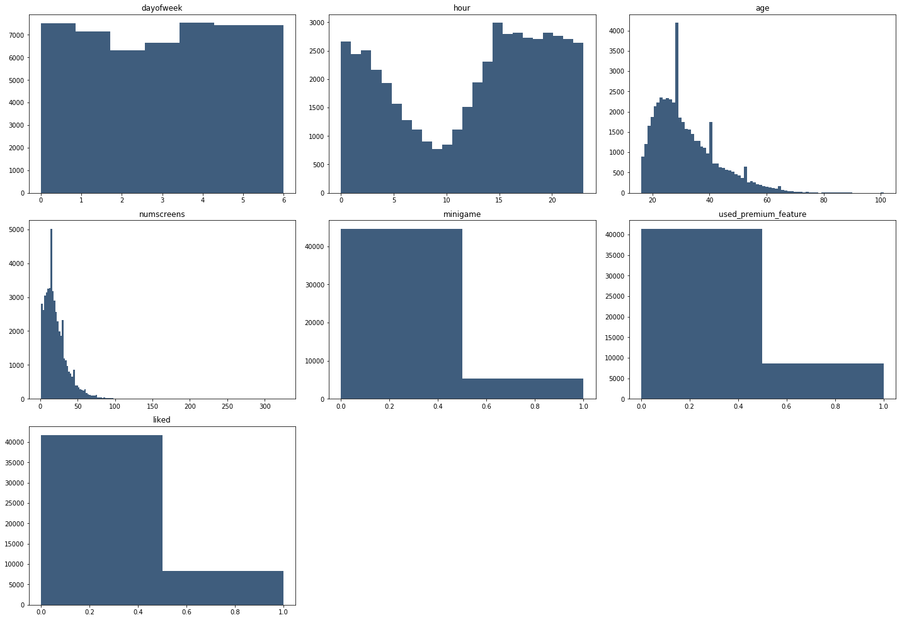
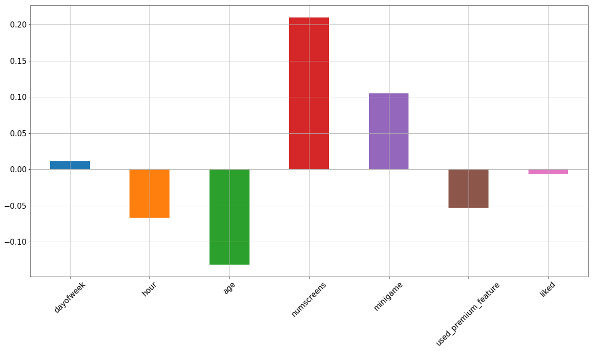
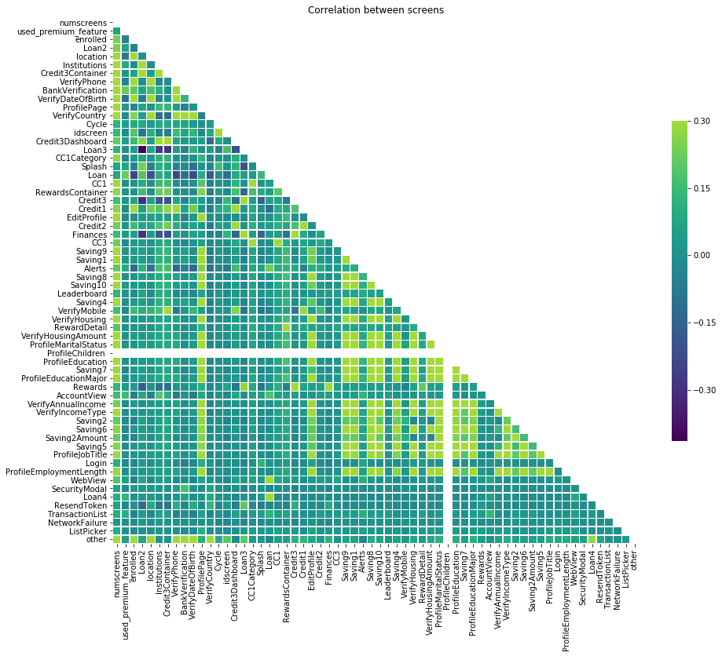

# Fintech Case Study

## Problem statement :
Directing customer to subscription through app behaviour analysis.

## Introduction :
Many companies provide free services to their users with an option to subscription of premium features. In this project we are analyzing data of a Finance Tracking App. This app offers a 24 hour free trial for paid features for the users. The goal is to predict if the user will subscribe to paid features based upon his behaviour in these 24 hours. Thus we can narrow the marketing strategy by giving discount offers to only those are highly unlikely to subscribe to the paid features.

## Data :
2 datasets have been given :

1. **appdata10.csv** - This dataset contains 50,000 rows with the following columns -
  * *userID* : (int64) unique ID
  * *first_open* : (object) date of first usage of app
  * *day of the week* : (int64)
  * *hour* : (int64)
  * *age* : (int64) age of the user
  * *screen_list* : (object) a list of all screens used during free trial
  * *numscreens* : (int64) number of screens in the list
  * *minigame* : (int64) binary value if the user played minigame or not
  * *used_premium_features* : (int64) binary value
  * *enrolled_date* : (object) date of subscription of paid features
  * *liked* : (int64) binary value
  * *enrolled* : (int64) binary value, this is the response variable

2. **top_screens.csv** - This dataset contains a list of screens sorted by their popularity of usage.

## Result :
Used Logistic Regression with l1 penalty to achieve **96%** accuracy.

### Model  :

This project contains 2 python scripts/notebooks:

1. **EDA.py :**

* Exploratory Data Analysis -

#### Histograms for distribution of numerical features

#### Correlation of features with Response Variable

* Feature Engineering -
  - Reduced response variable outliers
  - Created a binary variable for each screens in the screen_list
  - Created funnels for the screen_list

  Funnels are needed as there is Multicollinearity, due to high correlation between predictor variables. This is evident from the following correlation matrix.
  

  This cleaned data is then exported into "clean_appdata10.csv" and fed into _model.py_

2. **model.py :**

* Data Preprocessing -
  - Split into training and testing set with a ratio of 0.2
  - Standardized the values of the features

* Model Evaluation and Validation -
  - accuracy score : 0.76
  - recall score : 0.77
  - f1 score : 0.76
  - cross validation accuracy : 0.76 mean with 0.005 standard deviation
