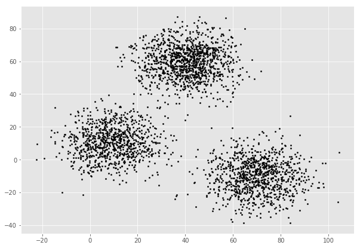
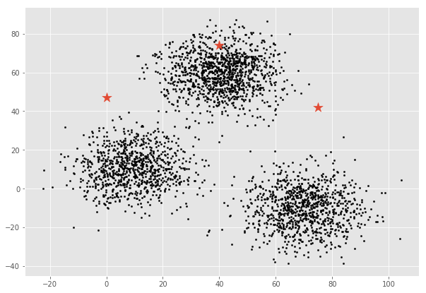
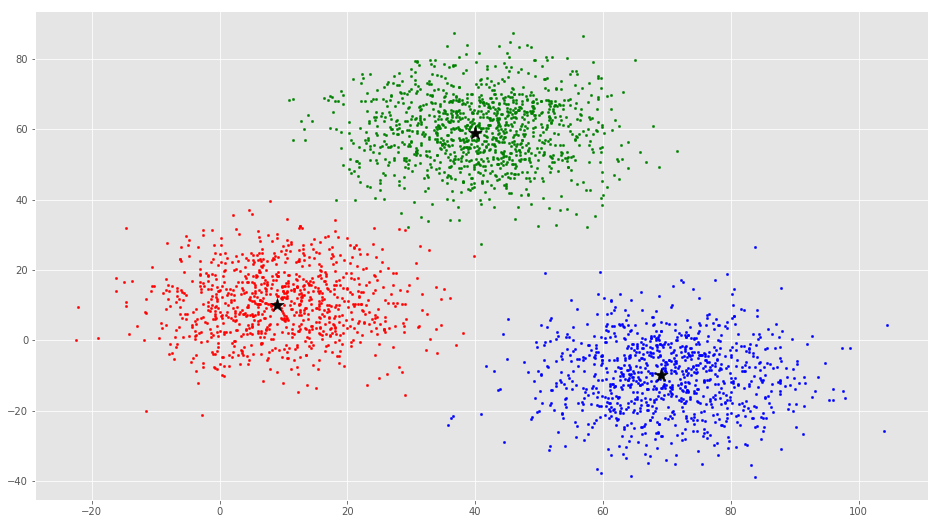

# K-means Clustering (using Python)

Performed clustering on xclara data with 3000 data points and 3 clusters

## Graphs and plots :

- **Scatter plot for raw data :**

	

- **Scatter plot for randomly generated centroids :**

	

- **Scatter plot after performing K means clustering :**
	
	