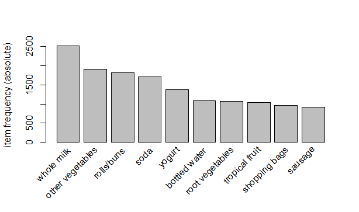
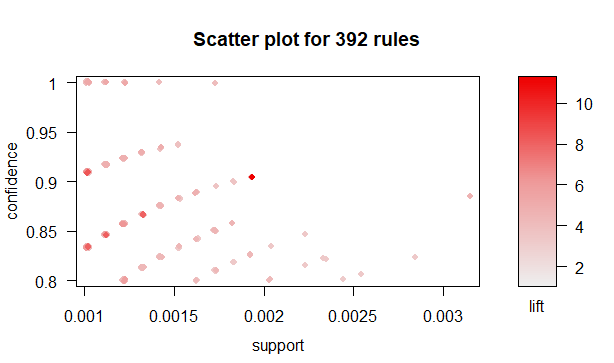
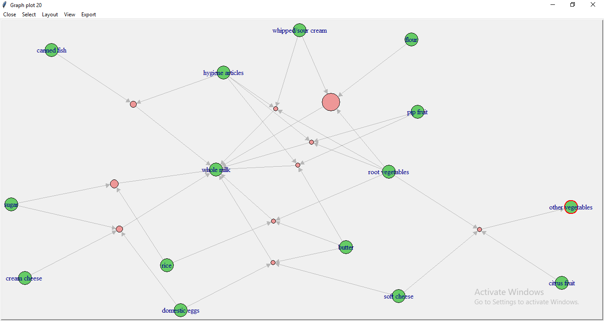

# Market Basket Analyis (using R)

Mined Association Rules for the "Groceries" dataset using *arules* and *arulesViz* libraies.
- Exploratory analysis
- Mined Rules
- Sorting rules and removing redundancies
- Targetting specific items ("whole milk" in this case)
- Visualizations

### Graphs and plots : 

- **Bar plot for frequency of items in dataset :**

    

- **Scatter plot for the mined rules :**

    

- **Graph for the top 10 rules :**

    